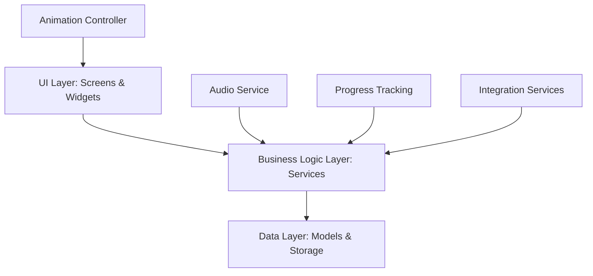

# Design Document

## Overview

This design document outlines the approach for enhancing the breathing exercises feature in the QuitVaping app. The enhancements will provide users with a more comprehensive, customizable, and engaging breathing exercise experience to help manage cravings and reduce stress during their quit journey. The design focuses on adding variety, customization, audio guidance, progress tracking, and integration with other app features.

## Architecture

The enhanced breathing exercises feature will build upon the existing architecture while adding new components and services. The architecture follows the app's established pattern of separation between UI, business logic, and data layers:



### Key Components:

1. **UI Layer**: Screens and widgets for exercise selection, customization, execution, and progress tracking
2. **Business Logic Layer**: Services for managing exercise data, audio, animations, and integration with other features
3. **Data Layer**: Models for exercise types, user preferences, and session history

## Components and Interfaces

### 1. Breathing Exercise Models

#### BreathingExerciseModel

```dart
class BreathingExerciseModel {
  final String id;
  final String name;
  final String description;
  final String benefitsDescription;
  final String iconPath;
  final String animationPath;
  final BreathingPattern defaultPattern;
  final List<String> tags; // e.g., "stress", "sleep", "craving"
  final int recommendedDuration; // in seconds
  
  // Constructor and methods
}
```

#### BreathingPattern

```dart
class BreathingPattern {
  final int inhaleSeconds;
  final int inhaleHoldSeconds;
  final int exhaleSeconds;
  final int exhaleHoldSeconds;
  
  // Constructor and methods
}
```

#### BreathingSessionModel

```dart
class BreathingSessionModel {
  final String id;
  final String exerciseId;
  final DateTime timestamp;
  final int durationSeconds;
  final BreathingPattern pattern;
  final bool completed;
  
  // Constructor and methods
}
```

### 2. Screens

#### BreathingExerciseListScreen

This screen will display a list of available breathing exercises with:
- Exercise name and icon
- Brief description
- Benefits tag
- Quick start button
- Detailed view navigation

#### BreathingExerciseDetailScreen

This screen will provide detailed information about a specific exercise:
- Comprehensive description and benefits
- Animation preview
- Customization options (duration, pattern)
- Start button

#### BreathingExerciseScreen

This screen will guide the user through the actual exercise:
- Visual animation synchronized with breathing pattern
- Timer and progress indicator
- Audio guidance controls
- Pause/resume functionality
- End early option

#### BreathingHistoryScreen

This screen will display the user's breathing exercise history:
- Calendar view of practice days
- Statistics (total sessions, total minutes, streak)
- Favorite exercises
- Progress charts

### 3. Services

#### BreathingExerciseService

```dart
class BreathingExerciseService {
  // Get available exercises
  Future<List<BreathingExerciseModel>> getExercises();
  
  // Get user's favorite or recommended exercises
  Future<List<BreathingExerciseModel>> getRecommendedExercises();
  
  // Get exercise by ID
  Future<BreathingExerciseModel> getExerciseById(String id);
  
  // Save user preferences for an exercise
  Future<void> saveExercisePreferences(String exerciseId, BreathingPattern pattern, int duration);
  
  // Get user preferences for an exercise
  Future<Map<String, dynamic>> getExercisePreferences(String exerciseId);
  
  // Record a completed session
  Future<void> recordSession(BreathingSessionModel session);
  
  // Get user's session history
  Future<List<BreathingSessionModel>> getSessionHistory([DateTime? startDate, DateTime? endDate]);
  
  // Get statistics about user's practice
  Future<Map<String, dynamic>> getStatistics();
}
```

#### BreathingAudioService

```dart
class BreathingAudioService {
  // Initialize audio for a specific exercise
  Future<void> initializeAudio(BreathingExerciseModel exercise, BreathingPattern pattern);
  
  // Start audio guidance
  Future<void> startAudio();
  
  // Pause audio guidance
  Future<void> pauseAudio();
  
  // Resume audio guidance
  Future<void> resumeAudio();
  
  // Stop audio guidance
  Future<void> stopAudio();
  
  // Set volume level
  Future<void> setVolume(double volume);
  
  // Check if audio is enabled
  bool isAudioEnabled();
  
  // Toggle audio enabled state
  Future<void> toggleAudio(bool enabled);
}
```

#### BreathingAnimationController

```dart
class BreathingAnimationController {
  // Initialize animation for a specific exercise
  void initializeAnimation(BreathingExerciseModel exercise, BreathingPattern pattern);
  
  // Start animation
  void startAnimation();
  
  // Pause animation
  void pauseAnimation();
  
  // Resume animation
  void resumeAnimation();
  
  // Stop animation
  void stopAnimation();
  
  // Get current animation state
  AnimationState getState();
}
```

### 4. Widgets

#### BreathingExerciseCard

A card widget displaying exercise information in the list view:
- Exercise icon and name
- Brief description
- Quick start button

#### BreathingAnimationWidget

A widget that displays the breathing animation:
- Visual cues for inhale, hold, and exhale
- Synchronized with the breathing pattern
- Responsive to different screen sizes

#### BreathingPatternCustomizer

A widget for customizing the breathing pattern:
- Sliders for inhale, hold, exhale, hold durations
- Preset patterns (beginner, intermediate, advanced)
- Save as favorite option

#### BreathingProgressChart

A widget displaying progress over time:
- Session frequency
- Duration trends
- Achievement indicators

## Data Models

### Exercise Types

The app will include the following breathing exercise types:

1. **Box Breathing (4-4-4-4)**
   - Equal duration for inhale, hold, exhale, hold
   - Benefits: Reduces stress, improves concentration
   - Good for: Immediate craving management

2. **4-7-8 Breathing**
   - Inhale for 4, hold for 7, exhale for 8
   - Benefits: Promotes relaxation, helps with sleep
   - Good for: Evening wind-down, anxiety reduction

3. **Diaphragmatic Breathing (Belly Breathing)**
   - Deep inhale expanding belly, slow exhale
   - Benefits: Activates relaxation response, increases oxygen
   - Good for: Stress reduction, physical craving symptoms

4. **Alternate Nostril Breathing**
   - Alternating breath between nostrils
   - Benefits: Balances nervous system, improves focus
   - Good for: Concentration, balancing emotions

5. **Pursed Lip Breathing**
   - Inhale through nose, exhale slowly through pursed lips
   - Benefits: Improves breathing pattern, releases trapped air
   - Good for: Shortness of breath, anxiety

6. **Coherent Breathing**
   - Slow breathing at 5-6 breaths per minute
   - Benefits: Heart rate variability improvement, stress reduction
   - Good for: Overall wellbeing, stress management

### User Preferences

User preferences will be stored using the app's existing storage service:

```dart
class BreathingPreferences {
  final bool audioEnabled;
  final double audioVolume;
  final Map<String, BreathingPattern> savedPatterns;
  final Map<String, int> savedDurations;
  final String lastUsedExerciseId;
  
  // Constructor and methods
}
```

### Session History

Session history will be stored in a local database:

```dart
// Database schema
final breathingSessionsTable = '''
  CREATE TABLE breathing_sessions (
    id TEXT PRIMARY KEY,
    exercise_id TEXT NOT NULL,
    timestamp INTEGER NOT NULL,
    duration_seconds INTEGER NOT NULL,
    inhale_seconds INTEGER NOT NULL,
    inhale_hold_seconds INTEGER NOT NULL,
    exhale_seconds INTEGER NOT NULL,
    exhale_hold_seconds INTEGER NOT NULL,
    completed INTEGER NOT NULL
  )
''';
```

## Error Handling

The breathing exercises feature will implement comprehensive error handling:

1. **Audio Initialization Failures**
   - Fallback to visual-only guidance
   - Clear error messages to users
   - Automatic retry mechanism

2. **Storage Errors**
   - Local caching of exercise data
   - Graceful degradation of history features
   - Background retry for saving session data

3. **Animation Issues**
   - Simplified fallback animations
   - Text-based guidance as backup
   - Performance monitoring to adjust complexity

4. **Integration Failures**
   - Standalone functionality preserved
   - Graceful handling of missing dependencies
   - User notification only when necessary

## Testing Strategy

### Unit Tests

- Test BreathingExerciseService methods
- Test BreathingAudioService functionality
- Test data persistence and retrieval
- Test pattern calculations and timing logic

### Widget Tests

- Test BreathingAnimationWidget rendering
- Test BreathingPatternCustomizer interactions
- Test exercise list and detail screens
- Test accessibility features

### Integration Tests

- Test complete breathing exercise flow
- Test audio-visual synchronization
- Test integration with other app features
- Test offline functionality

### User Testing

- Test with different user experience levels
- Gather feedback on exercise effectiveness
- Evaluate customization options usability
- Assess audio guidance clarity

## Integration Points

### Craving Tracker Integration

When a user logs a craving in the tracking feature:
- Suggest specific breathing exercises based on craving intensity
- Provide quick access to start a relevant exercise
- Record the connection between craving and breathing session

### Panic Mode Integration

When a user activates panic mode:
- Immediately offer a simple breathing exercise (Box Breathing)
- Simplify the UI for distress situations
- Provide clear, calming guidance

### Health Metrics Integration

After completing breathing exercises:
- Update stress management metrics
- Connect breathing practice to overall quit progress
- Show correlation between regular practice and reduced cravings

### Notification Integration

For scheduled reminders:
- Include specific breathing exercise recommendations
- Personalize based on user's favorite techniques
- Time suggestions based on user's craving patterns

## Accessibility Considerations

- High contrast mode for visual animations
- Haptic feedback option for breathing cues
- Screen reader support for all instructions
- Alternative to audio guidance (visual or haptic)
- Adjustable animation speed for different abilities