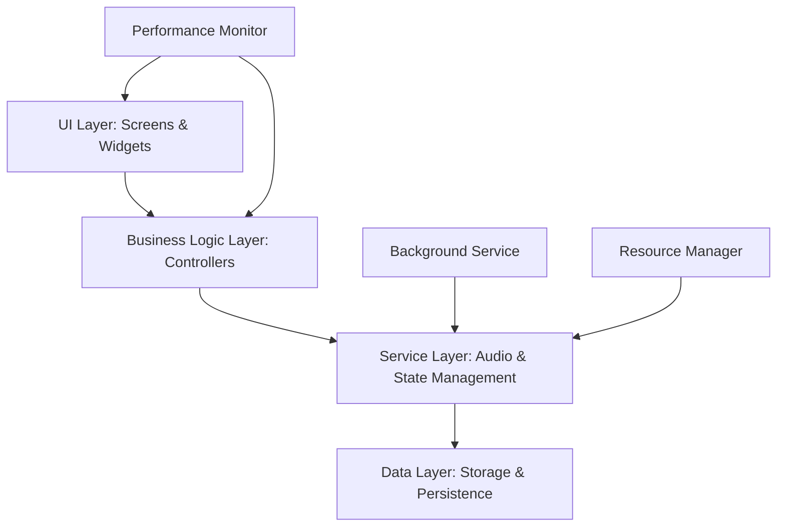

# Design Document

## Overview

This design document outlines the approach for optimizing the breathing exercises feature in the QuitVaping app. The optimizations focus on improving performance, enhancing user experience, adding background mode support, implementing pattern presets, and reducing resource usage. These improvements will make the breathing exercises more responsive, accessible, and user-friendly while ensuring efficient resource usage on all devices.

## Architecture

The optimized breathing exercises feature will maintain the existing architecture while enhancing specific components for better performance and adding new capabilities:



### Key Components:

1. **UI Layer**: Optimized screens and widgets with efficient rendering and state management
2. **Business Logic Layer**: Enhanced controllers with improved synchronization and reduced overhead
3. **Service Layer**: Optimized services for audio playback, background operation, and resource management
4. **Data Layer**: Efficient storage for user preferences, presets, and session history
5. **Background Service**: New component for maintaining exercise state when app is in background
6. **Performance Monitor**: New component for adapting to device capabilities
7. **Resource Manager**: New component for efficient resource allocation and cleanup

## Components and Interfaces

### 1. Optimized Audio Service

```dart
class BreathingAudioServiceOptimized implements BreathingAudioService {
  // Existing methods from BreathingAudioService
  
  // New methods for background mode
  Future<void> enableBackgroundMode();
  Future<void> disableBackgroundMode();
  bool isBackgroundModeEnabled();
  
  // New methods for resource optimization
  Future<void> preloadAudioAssets();
  Future<void> releaseUnusedResources();
  
  // New methods for performance monitoring
  Future<AudioPerformanceMetrics> getPerformanceMetrics();
  Future<void> setOptimizationLevel(OptimizationLevel level);
}

enum OptimizationLevel {
  low,    // For low-end devices
  medium, // For mid-range devices
  high    // For high-end devices
}

class AudioPerformanceMetrics {
  final double cpuUsage;
  final double memoryUsage;
  final int loadTimeMs;
  final int playbackLatencyMs;
  
  // Constructor and methods
}
```

### 2. Background Audio Handler

```dart
class BreathingBackgroundHandler {
  // Initialize background service
  Future<void> initialize();
  
  // Start background playback
  Future<void> startBackgroundPlayback(
    BreathingExerciseModel exercise,
    BreathingPattern pattern,
    int durationSeconds
  );
  
  // Update background playback state
  Future<void> updateBackgroundState(BreathingPhase phase, int secondsRemaining);
  
  // Stop background playback
  Future<void> stopBackgroundPlayback();
  
  // Get current background state
  Future<BackgroundPlaybackState?> getCurrentState();
  
  // Listen to state changes
  Stream<BackgroundPlaybackState> get stateStream;
}

class BackgroundPlaybackState {
  final bool isPlaying;
  final BreathingPhase currentPhase;
  final int secondsRemaining;
  final int elapsedSeconds;
  final int totalSeconds;
  final int completedCycles;
  
  // Constructor and methods
}
```

### 3. Enhanced Animation Widget

```dart
class EnhancedBreathingAnimationWidget extends StatefulWidget {
  // Existing properties from BreathingAnimationWidget
  
  // New properties for enhanced visualization
  final bool showPhaseProgress;
  final bool showTransitionCountdown;
  final AnimationComplexity complexity;
  
  // Constructor and methods
}

enum AnimationComplexity {
  simple,   // Basic animation for low-end devices
  standard, // Standard animation for mid-range devices
  advanced  // Advanced animation with particles for high-end devices
}
```

### 4. Pattern Preset Manager

```dart
class BreathingPresetManager {
  // Get all saved presets
  Future<List<BreathingPreset>> getPresets();
  
  // Save a new preset
  Future<void> savePreset(BreathingPreset preset);
  
  // Update an existing preset
  Future<void> updatePreset(String presetId, BreathingPreset updatedPreset);
  
  // Delete a preset
  Future<void> deletePreset(String presetId);
  
  // Reorder presets
  Future<void> reorderPresets(List<String> newOrder);
}

class BreathingPreset {
  final String id;
  final String name;
  final String exerciseId;
  final BreathingPattern pattern;
  final int durationSeconds;
  final DateTime createdAt;
  final DateTime lastUsedAt;
  final int useCount;
  
  // Constructor and methods
}
```

### 5. Performance Monitor

```dart
class BreathingPerformanceMonitor {
  // Initialize performance monitoring
  Future<void> initialize();
  
  // Run performance test
  Future<DevicePerformanceProfile> runPerformanceTest();
  
  // Get recommended settings for current device
  Future<OptimizedSettings> getRecommendedSettings();
  
  // Monitor performance during exercise
  Stream<PerformanceMetrics> monitorPerformance();
  
  // Adapt settings based on current performance
  Future<void> adaptSettings(PerformanceMetrics metrics);
}

class DevicePerformanceProfile {
  final DevicePerformanceTier tier;
  final double cpuScore;
  final double memoryScore;
  final double renderScore;
  
  // Constructor and methods
}

enum DevicePerformanceTier {
  low,
  medium,
  high
}

class OptimizedSettings {
  final AnimationComplexity animationComplexity;
  final OptimizationLevel audioOptimizationLevel;
  final bool enableBackgroundMode;
  final bool useHapticFeedback;
  
  // Constructor and methods
}

class PerformanceMetrics {
  final double cpuUsage;
  final double memoryUsage;
  final double frameRate;
  final double batteryDrain;
  
  // Constructor and methods
}
```

## Data Models

### Enhanced Breathing Session Model

```dart
class EnhancedBreathingSessionModel extends BreathingSessionModel {
  final Map<String, dynamic> performanceMetrics;
  final bool completedInBackground;
  final String? presetId;
  final List<PhaseCompletion> phaseCompletions;
  
  // Constructor and methods
}

class PhaseCompletion {
  final BreathingPhase phase;
  final DateTime timestamp;
  final int durationMs;
  
  // Constructor and methods
}
```

### Breathing Preset Schema

```dart
// Database schema
final breathingPresetsTable = '''
  CREATE TABLE breathing_presets (
    id TEXT PRIMARY KEY,
    name TEXT NOT NULL,
    exercise_id TEXT NOT NULL,
    inhale_seconds INTEGER NOT NULL,
    inhale_hold_seconds INTEGER NOT NULL,
    exhale_seconds INTEGER NOT NULL,
    exhale_hold_seconds INTEGER NOT NULL,
    duration_seconds INTEGER NOT NULL,
    created_at INTEGER NOT NULL,
    last_used_at INTEGER,
    use_count INTEGER NOT NULL DEFAULT 0,
    display_order INTEGER NOT NULL
  )
''';
```

## Error Handling

The optimized breathing exercises feature will implement enhanced error handling:

1. **Background Mode Failures**
   - Graceful fallback to foreground-only mode
   - Automatic retry with exponential backoff
   - Clear user notification with option to continue in foreground

2. **Performance Degradation**
   - Automatic scaling down of animation complexity
   - Proactive resource cleanup
   - Background task throttling

3. **Audio Playback Issues**
   - Multiple fallback mechanisms (local files, simplified cues)
   - Automatic recovery from audio focus loss
   - Silent mode detection and adaptation

4. **Storage Errors**
   - In-memory caching with delayed persistence
   - Conflict resolution for preset management
   - Data integrity validation

## Testing Strategy

### Performance Testing

- Benchmark frame rates during animations
- Measure memory usage over extended sessions
- Profile CPU usage during different phases
- Test battery consumption in various modes

### Device Compatibility Testing

- Test on low-end devices (1GB RAM, older CPUs)
- Test on mid-range devices (2-3GB RAM, mid-range CPUs)
- Test on high-end devices (4GB+ RAM, flagship CPUs)
- Verify adaptive behavior across device tiers

### Background Mode Testing

- Test background audio continuation
- Verify notification controls functionality
- Test state restoration when returning to app
- Measure battery impact of background operation

### Resource Usage Testing

- Monitor memory leaks during extended usage
- Test resource cleanup effectiveness
- Verify audio resource management
- Measure startup time with preloaded resources

## Integration Points

### Background Service Integration

The background service will integrate with the Android and iOS audio systems:

```dart
// Android service registration
@override
Future<void> configure() {
  return AudioServiceBackground.configure(
    androidNotificationChannelId: 'com.quitvaping.breathing',
    androidNotificationChannelName: 'Breathing Exercises',
    androidNotificationOngoing: true,
    androidStopForegroundOnPause: false,
    androidNotificationIcon: 'drawable/ic_breathing',
    notificationColor: 0xFF1E88E5,
    androidShowNotificationBadge: true,
    artDownscaleSize: Size(300, 300),
    fastForwardInterval: 30,
    rewindInterval: 30,
  );
}
```

### Performance Monitoring Integration

The performance monitor will integrate with Flutter's performance APIs:

```dart
class PerformanceMonitorBinding extends WidgetsFlutterBinding {
  @override
  void handleBeginFrame(Duration rawTimeStamp) {
    final frameStartTime = DateTime.now().millisecondsSinceEpoch;
    super.handleBeginFrame(rawTimeStamp);
    _recordFrameMetrics(frameStartTime);
  }
  
  void _recordFrameMetrics(int startTimeMs) {
    final frameTime = DateTime.now().millisecondsSinceEpoch - startTimeMs;
    BreathingPerformanceMonitor.instance.recordFrameTime(frameTime);
  }
}
```

### Preset Integration with Exercise Selection

Presets will be integrated into the exercise selection flow:

```dart
class BreathingExerciseListScreen extends StatelessWidget {
  @override
  Widget build(BuildContext context) {
    return Column(
      children: [
        // Presets section
        BreathingPresetList(
          onPresetSelected: (preset) {
            // Start exercise with preset
            Navigator.of(context).pushNamed(
              '/breathing/exercise',
              arguments: {
                'exercise': preset.exercise,
                'customPattern': preset.pattern,
                'duration': preset.durationSeconds,
                'presetId': preset.id,
              },
            );
          },
        ),
        
        // Divider
        Divider(),
        
        // Regular exercise list
        BreathingExerciseList(
          // Existing implementation
        ),
      ],
    );
  }
}
```

## Optimization Techniques

### Animation Optimization

1. **Efficient Rendering**
   - Use `RepaintBoundary` to isolate animations
   - Implement custom painters for complex animations
   - Use `AnimatedBuilder` for targeted rebuilds

2. **Adaptive Complexity**
   - Implement tiered animation complexity
   - Dynamically adjust based on device performance
   - Provide simplified fallbacks for low-end devices

### Memory Optimization

1. **Resource Management**
   - Implement lazy loading for audio assets
   - Release unused resources proactively
   - Use weak references for caching

2. **State Management**
   - Minimize state duplication
   - Use efficient state update patterns
   - Implement proper disposal of resources

### CPU Optimization

1. **Computation Efficiency**
   - Move heavy calculations off the UI thread
   - Implement debouncing for rapid updates
   - Cache computed values where appropriate

2. **Background Processing**
   - Throttle background tasks
   - Implement efficient background-foreground synchronization
   - Use platform channels for native optimizations

## Accessibility Considerations

- Enhanced TalkBack/VoiceOver support with detailed phase descriptions
- Haptic feedback patterns for different breathing phases
- High contrast mode for visual animations
- Audio-only mode with enhanced verbal cues
- Reduced motion option for users with motion sensitivity

## Implementation Priorities

1. **Critical Path**
   - Fix import errors and missing files
   - Implement optimized audio service
   - Update screen references

2. **High Impact**
   - Implement background mode
   - Optimize animation performance
   - Add preset management

3. **Enhancement**
   - Implement enhanced visual feedback
   - Add adaptive complexity
   - Create performance monitoring

4. **Polish**
   - Refine accessibility features
   - Optimize resource usage
   - Enhance error handling