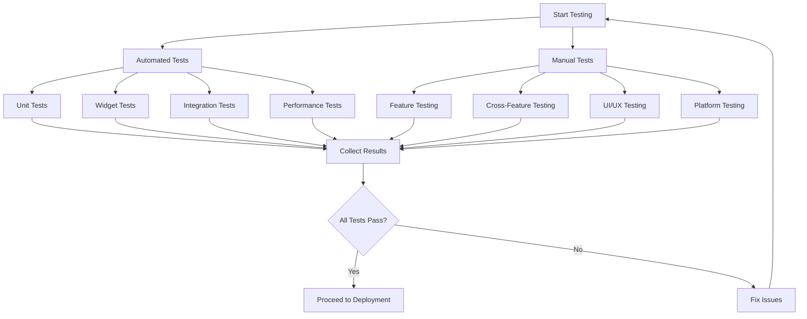
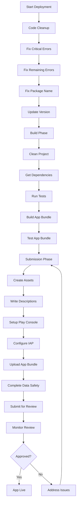
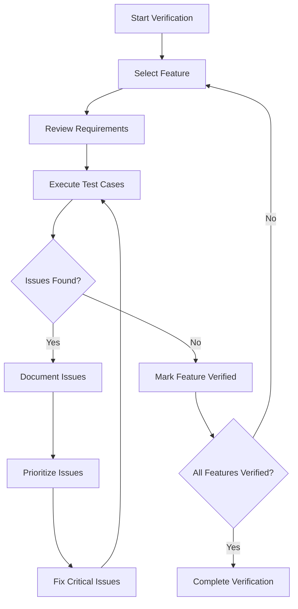

# Deployment Readiness Design Document

## Overview

This document outlines the design for ensuring the QuitVaping app is ready for deployment to the Google Play Store. It covers the approach for feature verification, testing methodologies, and deployment preparation.

## Architecture

The QuitVaping app follows a feature-based architecture with the following main components:

1. **Core Features**:
   - Breathing Exercises
   - Tracker
   - Health Info
   - Check-ins
   - Panic Mode
   - NRT Tracker
   - AI Chat
   - Profile
   - Reminders
   - Settings
   - Subscription

2. **Shared Components**:
   - Theme and styling
   - Navigation
   - Data persistence
   - Notifications
   - Analytics
   - In-app purchases

3. **Platform Integration**:
   - Android-specific functionality
   - Background processing
   - Permissions handling
   - Notification channels

## Components and Interfaces

### 1. Testing Framework

#### 1.1 Automated Testing

The automated testing framework consists of:

- **Unit Tests**: Test individual components in isolation
- **Widget Tests**: Test UI components and their interactions
- **Integration Tests**: Test multiple components working together
- **Performance Tests**: Measure performance metrics

#### 1.2 Manual Testing

Manual testing will be conducted using:

- **Test Cases**: Structured test cases for each feature
- **Exploratory Testing**: Unstructured testing to find edge cases
- **User Scenarios**: Testing common user flows
- **Device Testing**: Testing on different device profiles

#### 1.3 Testing Tools

The following tools will be used for testing:

- **Flutter Test**: For unit and widget tests
- **Flutter Driver**: For integration tests
- **DevTools**: For performance profiling
- **Firebase Test Lab**: For device testing

### 2. Deployment Pipeline

#### 2.1 Code Cleanup

The code cleanup process includes:

- **Error Fixing**: Running scripts to fix critical and remaining errors
- **Package Name Fixing**: Ensuring the Android package name is correct
- **Version Update**: Updating the app version in pubspec.yaml

#### 2.2 Build Process

The build process includes:

- **Project Cleaning**: Running `flutter clean`
- **Dependency Resolution**: Running `flutter pub get`
- **Testing**: Running `flutter test`
- **App Bundle Creation**: Running `flutter build appbundle --release`

#### 2.3 Play Store Submission

The Play Store submission process includes:

- **Asset Creation**: Creating app icon, feature graphic, and screenshots
- **Description Writing**: Writing short and full descriptions
- **Privacy Policy**: Preparing a privacy policy URL
- **Play Console Setup**: Setting up the app in the Google Play Console
- **In-App Purchase Setup**: Setting up subscription products
- **App Bundle Upload**: Uploading the App Bundle
- **Data Safety Section**: Completing the data safety section
- **Review Submission**: Submitting the app for review

### 3. Monitoring and Feedback

#### 3.1 Crash Reporting

Crash reporting will be implemented using:

- **Firebase Crashlytics**: For crash detection and reporting
- **Error Boundaries**: For graceful error handling
- **Custom Logging**: For detailed error information

#### 3.2 Analytics

Analytics will be implemented using:

- **Firebase Analytics**: For user behavior tracking
- **Custom Events**: For tracking specific interactions
- **Conversion Tracking**: For tracking subscription conversions
- **Retention Metrics**: For tracking user retention

#### 3.3 User Feedback

User feedback will be collected using:

- **In-App Feedback**: A feedback form within the app
- **Play Store Reviews**: Monitoring and responding to reviews
- **Support Email**: A dedicated support email address
- **Feature Request System**: A system for collecting and prioritizing feature requests

## Data Models

### 1. Test Result Model

```dart
class TestResult {
  final String testName;
  final bool passed;
  final String? errorMessage;
  final DateTime timestamp;
  
  TestResult({
    required this.testName,
    required this.passed,
    this.errorMessage,
    required this.timestamp,
  });
}
```

### 2. Performance Metric Model

```dart
class PerformanceMetric {
  final String metricName;
  final double value;
  final String unit;
  final DateTime timestamp;
  final String deviceInfo;
  
  PerformanceMetric({
    required this.metricName,
    required this.value,
    required this.unit,
    required this.timestamp,
    required this.deviceInfo,
  });
}
```

### 3. Deployment Checklist Item Model

```dart
class ChecklistItem {
  final String id;
  final String description;
  final bool completed;
  final String? notes;
  final DateTime? completedAt;
  
  ChecklistItem({
    required this.id,
    required this.description,
    required this.completed,
    this.notes,
    this.completedAt,
  });
}
```

## Error Handling

### 1. Test Failures

When a test fails:

1. Log detailed error information
2. Capture screenshots or state information when possible
3. Categorize the failure (critical, major, minor)
4. Add the issue to a tracking system
5. Prioritize fixes based on severity

### 2. Build Failures

When a build fails:

1. Log the build error
2. Identify the cause (code error, dependency issue, configuration problem)
3. Fix the underlying issue
4. Verify the fix with a new build
5. Document the issue and solution for future reference

### 3. Submission Rejections

When a Play Store submission is rejected:

1. Carefully review the rejection reason
2. Address all issues mentioned in the rejection
3. Test the fixes thoroughly
4. Resubmit with detailed notes on the changes made
5. If necessary, appeal the rejection with supporting information

## Testing Strategy

### 1. Feature Testing

Each feature will be tested using the following approach:

1. **Unit Testing**: Test individual components and functions
2. **Widget Testing**: Test UI components and interactions
3. **Integration Testing**: Test feature components working together
4. **Manual Testing**: Test the complete feature with real user scenarios
5. **Edge Case Testing**: Test unusual or extreme scenarios

### 2. Cross-Feature Testing

Cross-feature testing will focus on:

1. **Navigation**: Testing navigation between features
2. **Data Sharing**: Testing data consistency across features
3. **State Preservation**: Testing state maintenance when switching features
4. **Performance Impact**: Testing performance when multiple features are used

### 3. UI/UX Testing

UI/UX testing will include:

1. **Visual Consistency**: Testing consistent use of colors, typography, and spacing
2. **Responsive Design**: Testing on different screen sizes and orientations
3. **Accessibility**: Testing with screen readers and other accessibility tools
4. **User Flow**: Testing the intuitiveness of navigation and interactions

### 4. Platform Testing

Platform testing will focus on:

1. **Android Version Compatibility**: Testing on multiple Android versions
2. **Device Compatibility**: Testing on different device profiles
3. **Permission Handling**: Testing permission requests and handling
4. **Background Behavior**: Testing app behavior when in the background

### 5. Performance Testing

Performance testing will measure:

1. **Startup Time**: Time to load the app and reach interactive state
2. **Memory Usage**: Memory consumption during normal and extended use
3. **CPU Usage**: CPU utilization during different operations
4. **Battery Impact**: Battery consumption during typical usage patterns
5. **Network Efficiency**: Efficient use of network resources

## Deployment Process

### 1. Pre-Deployment Phase

1. Complete all feature development and testing
2. Fix all critical and major issues
3. Run code cleanup scripts
4. Update app version
5. Prepare release notes

### 2. Build Phase

1. Clean the project
2. Get dependencies
3. Run tests
4. Build the App Bundle
5. Test the App Bundle on real devices

### 3. Submission Phase

1. Create and optimize Play Store assets
2. Write compelling app descriptions
3. Set up the app in the Google Play Console
4. Configure in-app purchases
5. Upload the App Bundle
6. Complete all required sections
7. Submit for review

### 4. Post-Deployment Phase

1. Monitor the review process
2. Address any issues raised by the review team
3. Prepare for app launch marketing
4. Set up monitoring and analytics
5. Establish user feedback channels
6. Plan for future updates

## Diagrams

### 1. Testing Workflow



### 2. Deployment Pipeline



### 3. Feature Verification Process



## Conclusion

This design document outlines a comprehensive approach to ensuring the QuitVaping app is ready for deployment to the Google Play Store. By following the testing strategy, deployment process, and monitoring plan described here, we can ensure a high-quality app that meets all requirements and provides a good user experience.